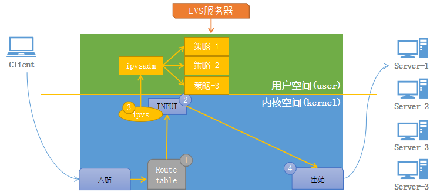
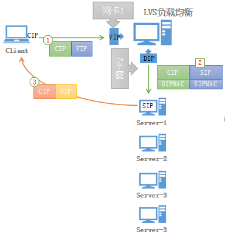
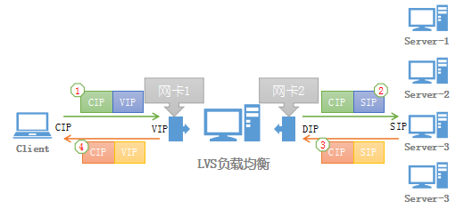

### LVS 原理

###### LVS实现方式：
  - LVS的IP负载均衡技术是通过ipvs内核模块来实现的
  - ipvs是LVS集群系统的核心软件。

###### LVS分为两个部件：ipvs和ipvsadm
  - ipvs ： 工作于内核空间，主要用于使用户定义的策略生效；
  - ipvsadm : 工作于用户空间，主要用于用户定义和管理集群服务的工具；

###### LVS工作原理：

  - 1.当收到用户请求某集群服务时，经检查本机路由表
  - 2.送往INPUT链
  - 3.在进入INPUT链时，ipvs强行将请求报文通过ipvsadm定义的集群服务策略的路径
  - 4.将报文转发至后端真实提供服务的主机。

##### LVS模式讲解

###### LVS-DR模式原理：（重点）

- ①.客户端将请求发往前端的负载均衡器，请求报文源地址是CIP，目标地址为VIP。
- ②.负载均衡器收到报文后，发现请求的是在规则里面存在的地址，那么它将客户端请求报文的源MAC地址改为自己DIP的            MAC地址，目标MAC改为了SIP的MAC地址，并将此包发送给Server。
- ③.Sever发现请求报文中的目的MAC是自己，就会将此报文接收下来，处理完请求报文后，将响应报文通过lo接口送给eth0网卡直接发送给客户端。

**注意：需要设置lo接口的VIP不能响应本地网络内的arp请求**

###### LVS-NAT模式原理：

- ①.客户端将请求发往前端的负载均衡器，请求报文源地址是CIP(客户端IP),后面统称为CIP)，目标地址为VIP(负载均衡器前端地址，后面统称为VIP)。
- ②.负载均衡器收到报文后，发现请求的是在规则里面存在的地址，那么它将客户端请求报文的目标地址(VIP)改为了后端服务器的目标地址(SIP)并将报文根据算法发送出去。
- ③.报文送到Server后，由于报文的目标地址是自己，所以会响应该请求，并将响应报文返还给LVS。
- ④.然后lvs将此报文的源地址通过SNAT修改为本机并发送给客户端。
注意：在NAT模式中，Server的网关必须指向LVS，否则报文无法送达客户端。
