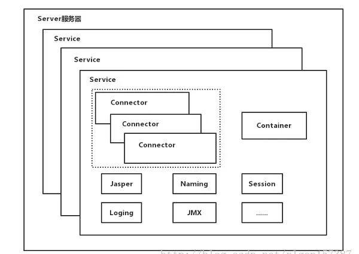
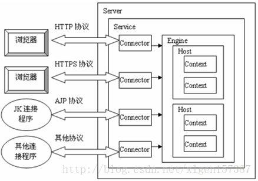

### Tomcat架构

###### Tomcat的顶层结构图

- Tomcat中最顶层的容器是Server，代表着整个服务器，从上图中可以看出，一个Server可以包含至少一个Service，用于具体提供服务。

- Service主要包含两个部分：Connector和Container。从上图中可以看出 Tomcat 的心脏就是这两个组件，他们的作用如下：

  - 1、Connector用于处理连接相关的事情，并提供Socket与Request和Response相关的转化;
  - 2、Container用于封装和管理Servlet，以及具体处理Request请求；

---
- 一个Tomcat中只有一个Server
- 一个Server可以包含多个Service，一个Service只有一个Container，但是可以有多个Connectors，这是因为一个服务可以有多个连接，如同时提供Http和Https链接，也可以提供向相同协议不同端口的连接,示意图如下（Engine、Host、Context下边会说到）：

- 多个 Connector 和一个 Container 就形成了一个 Service，有了 Service 就可以对外提供服务了，但是 Service 还要一个生存的环境，必须要有人能够给她生命、掌握其生死大权，那就非 Server 莫属了！所以整个 Tomcat 的生命周期由 Server 控制。

###### Tomcat顶层架构小结
- （1）Tomcat中只有一个Server，一个Server可以有多个Service，一个Service可以有多个Connector和一个Container；

- （2） Server掌管着整个Tomcat的生死大权；

- （3）Service 是对外提供服务的；

- （4）Connector用于接受请求并将请求封装成Request和Response来具体处理；

- （5）Container用于封装和管理Servlet，以及具体处理request请求；

知道了整个Tomcat顶层的分层架构和各个组件之间的关系以及作用，对于绝大多数的开发人员来说Server和Service对我们来说确实很远，而我们开发中绝大部分进行配置的内容是属于Connector和Container的，
