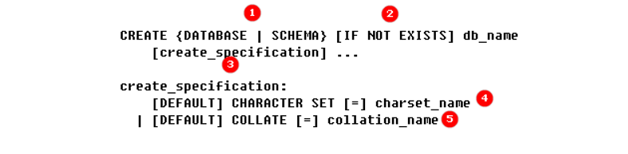
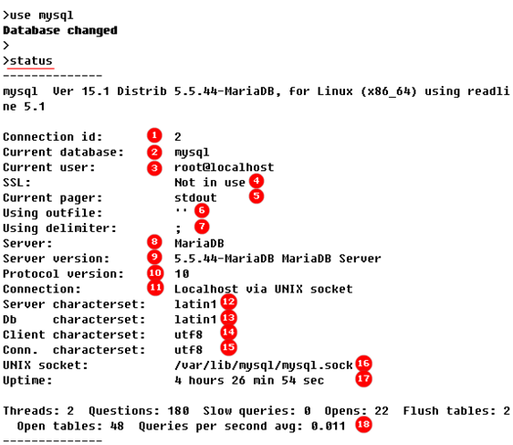

### MySQL库管理


##### 创建数据库

> 创建数据库的基础语法如下图，我们对比这下图中的编号一一进行描述



> 1、在其他关系型数据库中，database与schema是有区别的，但是在mysql 5.0.2以后，我们在创建数据库时可以不加区分的使用database和schema，我们可以将create schema理解为 create dataabse的代名词。

>2、if not exists表示在对应的数据库不存在的时候才会创建，if not exists被中括号括起来，表示此项为可选，建议在sql脚本中使用create命令创建数据库时加入此项，以免对应名称的数据库已经存在导致sql脚本终止。

> 3、create_specification表示我们可以在创建数据库时指定对应的数据库规范，规范具体内容见4和5。

> 4、我们可以在创建数据库时指定数据库的字符集，使用character set对应字符集名称即可指定使用什么字符集，如果使用了default关键字，那么这个数据库中创建的所有表默认都会继承这个数据库的字符集，default为可选选项，如果你不知道存在哪些字符集，可以使用"show character set;"命令查看所有可用字符集，针对数据库有数据库级别的字符集，针对表有表级别的字符集，针对客户端与服务端一次会话，又有会话级别的连接字符集，当我们使用status命令时，可以看到当前连接、客户端、数据库、以及服务器级别的字符集的值，如果我们在创建数据库的时候没有指定数据库的字符集，那么数据库默认继承服务器级别的字符集。

> 5、我们可以在创建数据库时指定数据库的排序规则，比如有多个汉字，我们是以笔画多少排序呢？还是以汉字对应的拼音首字母的顺序排序呢？还是以笔画的顺序排序呢？这种就可以理解为排序规则，同一种字符集下可能有多种排序规则，但是一种排序规则只能对应于一种字符集，也就是说，当你指定了一种排序规则，则不用再指定对应的字符集，因为这种排序规则肯定是针对某个字符集制定的排序规则，所以，如果给定了排序规则，则不要同时指明字符集，每一个字符集都有默认的排序规则，你可以只指定字符集，不指定排序规则，代表使用字符集默认的排序规则，使用"show collation;"命令可以查看所有可用的排序方式，以及排序方式对应的字符集，default为可选指令，作用与4中的default的作用相同。

######> 语句示例：

```shell
# 创建名为testdb的数据库
create database testdb;
# 如果名为testdb的数据库不存在，则创建之。
create database if not exists testdb;
# 如果名为testdb的数据库不存在，则创建之，并且设置其字符集为utf16.
create database if not exists testdb default character set utf16;
```

##### 查看数据库
```shell
# 列出所有已经存在的数据库，查看所有数据库：
show databases;
# 列出创建对应数据库的sql语句
show create database testdb;
# 查看可用的字符集的命令
show character set;
# 查看排序方式的命令
show collation;
```
###### 查看当前数据库与当前连接的概要信息

```shell
1 当前链接的id号
2 当前选择的使用的数据库
3 当前链接的登录用户
4 是否使用了ssl
7 当前会话的行终结符是分号
8 当前mysql版本为mariadb分支
9 当前mysql服务器的版本号
10 协议版本
11 使用的链接类型，通过本机的套接字文件进行连接
12 服务器使用的字符类型
13 当前数据库使用的字符类型
14 当前mysql客户端使用的字符类型
15 当前链接使用的字符类型
16 套接字文件路径
17 mysql数据库的启动时长
```

##### 修改数据库
```shell
# 修改数据库的基本语法如下：
ALTER {DATABASE | SCHEMA} [db_name] alter_specification ...

alter_specification:
[DEFAULT] CHARACTER SET [=] charset_name |  [DEFAULT] COLLATE [=] collation_name
```
```shell
# 修改数据库无非就是修改数据库的字符集，或者修改字符集的排序规则，
# 字符集与排序规则的概念已经在创建数据库的命令中描述过，此处不再赘述
# 但是需要注意的是，修改字符集与修改排序规则是"二选一"的，原因在创建数据库的命令中同样描述过，所以直接给出示例语句如下。
```
```shell
# 查看字符集
show variables like 'character%';
# 如果字符集与我们期望的字符集不相符，则使用如下语句修改数据库字符集
alter database testdb character set utf8;
# 修改数据库的字符集，并设置为默认字符集，数据库中的表都会继承此字符集
alter database testdb default character set utf8;
```


##### 删除数据库
```shell
删除数据库的基本语法如下，注意，删除操作无法恢复：
DROP {DATABASE | SCHEMA} [IF EXISTS] db_name
```
```shell
# 示例语句
drop database if exists testdb;
```
