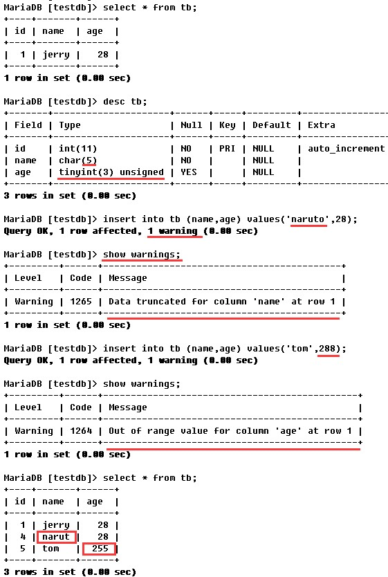
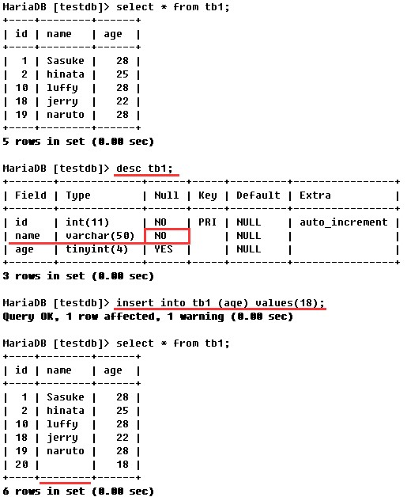

### MySQL插入语句(insert)
##### insert常用语句
```shell
# mysql中insert语句的语法如下
insert into tablename(字段1名称,字段2名称,...) values(字段1值,字段2值,...)
```
###### 示例如下：
```shell
# 向表tb1中插入一条数据，插入数据对应的字段为name和age，name的值为tom，age为33。
insert into tb1 (name,age) values('tom',33);
# 向表tb1中插入多条数据，具体含义同上，只不过是插入多条语句。
insert into tb1 (name,age) values('jerry',22),('naruto',28);
# 也可以不指定字段，表示对应每个字段都会有插入的数据。
insert into tb1 values (4,'Sasuke',28),(5,'hinata',25);
```
> 其实，除了使用上述的语法插入数据，我们还能够使用如下语法
```shell
insert into tablename set 字段1名称=字段1值,字段2名称=字段2值
```

###### 示例如下：
```shell
insert into tbl2 set id=2,name="test",age=18,gender='M';
```
```shell
注意：
**上述两种语法的不同之处在于，字段名称与字段值是否分开了，使用set的方式字段名与字段值是在一起的。**
**除了这一点不同之处，其实，他们还有另外一点不同，就是，使用set的方式插入数据时，insert语句中字段的顺序可以与表中字段的顺序不同**
**而第一种语法中，字段顺序必须与表中字段的顺序相同。**
```

> **还需要注意的是，mysql默认的sqlmode为宽松模式，这意味着即使插入的数据并不是完全符合数据类型的要求，也有可能也能插入数据。**

###### 示例如下：

> 可以从上图中看到，tb表中的name字段的数据类型为char(5)，也就是说name字段最多只能插入5个字符，当我们插入的数据为naruto时，超过了5个字符的长度，但是仍然插入成功了，插入的数据自动被截取为narut，少了一个字母"o",同理，age字段的值的最大取值为255，当我们插入大于255的数据时，数据自动变为了255，这样虽然能够插入数据，但是跟我们预期不一样，这种情况就属于对数据的校验不严格导致的

###### 再看另一种情况，如下图

> tb1表中的name字段是不允许为空的，并且name字段没有对应的默认值，但是我们如果不对name字段设置对应的值，数据也能插入，mysql自动将其值设置为了空字符串，如果按照严格的标准，这样应该不允许插入数据。上述两种情况都属于对数据的校验不严格造成的。

> 如果我们不期望这样的事情发生，可以通过设置sql_mode参数的值进行严格限制，我们可以通过运行时设置的方式（参考"mysql数据库变量(参数)管理"）与修改配置文件的方式设置sql_mode, 此时，如果你想要在不重启的mysql情况让以后的所有连接都遵循严格的限制，需要先在运行时设置中，将global.sql_mode变量的值设置为TRADITIONAL（使用的存储引擎为innodb），同时在配置文件中设置sql_mode=TRADITIONAL（使用的存储引擎为innodb），以免重启后失效。

##### sql_mode最常用的几种重要模式如下：

> 1. ANSI：宽松模式，对插入数据进行校验，如果不符合定义类型或长度，对数据截断保存，报警告信息，默认应该就是这种。

> 2. STRICT_TRANS_TABLES：只在事务型表中进行严格限制。

> 3. STRICT_ALL_TABLES：对所有表进行严格限制。

> 4. TRADITIONAL ：严格模式，当插入数据时，进行数据的严格校验，错误的数据将不能被插入，报error错误。用于事物时，会进行事物的回滚，官方提醒我们说，如果我们使用的存储引擎是非事务型的存储引擎（比如myisam），当我们使用这种模式时， 如果执行非法的插入或更新数据操作时，可能会出现部分完成的情况。
