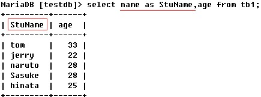

### MySQL语句(select语句总结之一：基本语句)

> 最简单最粗暴的查询语句如下，查询tb1表中的所有数据，如果表中的数据量巨大，那么使用如下语句纯属作死，非必要情况下，一般不要这样对数据进行查询，在如下示例中，为了方便总结，可能会经常使用这种查询方式
```shell
# 最简单最粗暴的查询语句如下
select * from tb1;
```
```shell
# 表示从tb1表中查询出所有数据，但是只显示前3行。
select * from tb1 limit 3;
```
```shell
# 从tb1表中查询出name字段与age字段的数据，即使这样写，也没有比上例的语句好多少，
# 它仍然是显示表中的所有行的指定字段，表中的数据量较大时，这样写也是非常不好的，除非必要，一般不要这样写。
select name,age from tb1;
```
```shell
# 从tb1表中查询出符合条件的数据，使用where字句给定条件，带有筛选条件的查询语句则会比上面两种查询语句好很多，
# 如下语句表示从tb1表中查询出age等于25的行的name和age字段。
select name,age from tb1 where age = 25;
```
```shell
# 查出tb1表中age不等于28的数据。
select * from tb1 where age != 28;
```
```shell
# 如下两条语句均表示从tb1表中查询出age大于等于25并且小于等于28的数据。
select * from tb1 where age >= 25 and age <=28;
select name,age from tb1 where age between 25 and 28;
```
```shell
# 如下语句表示从tb1表中查询出age等于25或者等于28的数据。
select * from tb1 where age = 25 or age = 28;
```
```shell
# 如下语句表示从tb1表中查询出age不在25到28区间中的数据。
select * from tb1 where age not between 25 and 28;
select * from tb1 where age < 25 or age > 28;
```
```shell
# 使用like结合通配符进行模糊查询，如下语句表示查询tb1表中name字段以j开头的数据，
#"%"在查询语句中表示"任意长度的任意字符".
select * from tb1 where name like 'j%';
```
```shell
如下语句表示查询tb1表中name字段以t开头，并且只有三个字符的数据，
# "_"在查询语句中表示"任意单个字符"，下例中的语句中，在t后面跟随了两个"_",表示t后面的两个字符可以是任意字符。
select * from tb1 where name like 't__';
```
```shell
# 也许你觉得还不够灵活，或许你更习惯使用正则表达式作为匹配条件，
# 没有关系，满足你，我们可以使用rlike结合正则表达式，对字符数据进行模糊查询，
# 所以，查询语句能有多强大的功能，就看你的正则表达式运用的有多熟练了，示例语句如下。
# 如下语句表示查询出tb1表中name字段以t开头的所有数据，正则表达式的含义此处不再赘述。
select * from tb1 where name rlike '^t.*';
```
```shell
# 我们还可以从指定的列表中匹配对应的条件，使用in关键字指定列表，
#示例如下，如下语句表示从tb1表中查找出age等于22、23、24或25中的任意一个的行的所有数据。
select * from tb1 where age in (22,23,24,25);
```
```shell
# 除了使用in，我们还可以使用not in,聪明如你一定秒懂，not in就是in的对立面，
# 比如，查询出tb1表中age不等于28、43、33的数据。
select * from tb1 where age not in (28,33,43);
```
```shell
# 我们可以对查询出的数据进行排序，如下示例表示查询tb1表中的所有数据，
# 并且按照age的值从小到大进行升序排序，asc表示升序排序，asc可省，默认使用升序排序。
select * from tb1 order by age;
select * from tb1 order by age asc;
```
```shell
# 如下示例表示查询tb1表中的所有数据，并且按照age的值从大到小进行降序排序。
select * from tb1 order by age desc;
```
```shell
# 查询tb1表中的所有数据，并且按照age的值从大到小进行降序排序，
# 如果多行之间的age字段的值相同时，这些行再根据name字段进行升序排序。
select * from tb1 order by age desc,name asc;
```
```shell
# 我们可以在查询某字段的时候去重，使用DISTINCT关键字表示去重查询，比如，查询学生的年龄并去重显示年龄。
select distinct age from students;
```
```shell
# 我们也可以在查询时给字段添加别名，以便显示为我们指定的列名。
select name as StuName,age from tb1;
```

