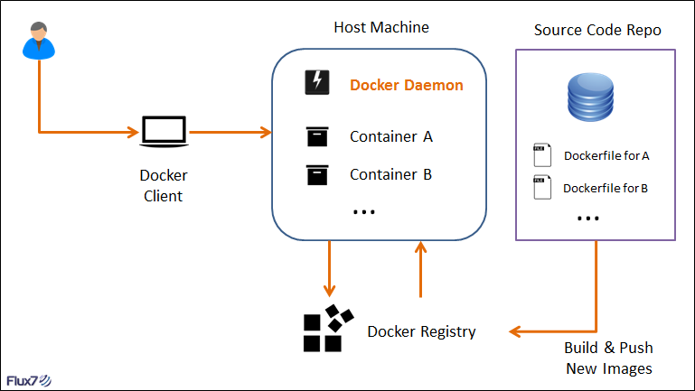

### Dockerfile

###### Dockerfile 到底是个什么东西呢？
```shell
Dockerfile 是自动构建 Docker 镜像的配置文件，用户可以使用 Dockerfile 快速创建自定义的镜像。
Dockerfile 中的命令非常类似于 Linux 下的 Shell 命令。
```


```shell
- 我们可以通过下面这幅图来直观地感受下 Docker 镜像、容器和 Dockerfile 三者之间的关系：
  - Dockerfile 可以自定义镜像，
  - 通过 Docker 命令去运行镜像，从而达到启动容器的目的。
  - Dockerfile 是由一行行命令语句组成，并且支持已 # 开头的注释行。
```
```shell
- 一般来说，我们可以将 Dockerfile 分为四个部分：
  - 1. 基础镜像（父镜像）信息指令 FROM。
  - 2. 维护者信息指令 MAINTAINER。
  - 3. 镜像操作指令 RUN 、EVN 、ADD 和 WORKDIR 等。
  - 4. 容器启动指令 CMD 、ENTRYPOINT 和 USER 等。
```

- 下面是一段简单的 Dockerfile 的例子：
  ```shell
    FROM python:2.7MAINTAINER Angel_Kitty <angelkitty6698@gmail.com>COPY . /app
    WORKDIR /app
    RUN pip install -r requirements.txt
    EXPOSE 5000ENTRYPOINT ["python"]CMD ["app.py"]
  ```

- 我们可以分析一下上面这个过程：
```shell
  - 1. 从 Docker Hub 上 Pull 下 Python 2.7 的基础镜像。
  - 2. 显示维护者的信息。
  - 3. Copy 当前目录到容器中的 /App 目录下 复制本地主机的 <src> ( Dockerfile 所在目录的相对路径)到容器里 <dest>。
  - 4. 指定工作路径为 /App。
  - 5. 安装依赖包。
  - 6. 暴露 5000 端口。
  - 7. 启动 App。
```

#### Dockerfile 常用的指令

- 根据上面的例子，我们已经差不多知道了 Dockerfile 的组成以及指令的编写过程，我们再来理解一下这些常用命令就会得心应手了。
```shell
由于 Dockerfile 中所有的命令都是以下格式：INSTRUCTION argument ，
指令（INSTRUCTION）不分大小写，但是推荐大写和 SQL 语句是不是很相似呢？
```
- 下面我们正式来讲解一下这些指令集吧。


###### FROM
  ```shell
  FROM 是用于指定基础的 images ，一般格式为 FROM <image> or FORM <image>:<tag>。
  所有的 Dockerfile 都应该以 FROM 开头，
  FROM 命令指明 Dockerfile 所创建的镜像文件以什么镜像为基础，
  FROM 以后的所有指令都会在 FROM 的基础上进行创建镜像。
  可以在同一个 Dockerfile 中多次使用 FROM 命令用于创建多个镜像。
  ```

- 比如我们要指定 Python 2.7 的基础镜像，我们可以像如下写法一样：
  ```shell
  FROM python:2.7
  ```

###### MAINTAINER
  ```shell
  MAINTAINER 是用于指定镜像创建者和联系方式，一般格式为 MAINTAINER <name>。
  ```
  - 这里我设置成我的 ID 和邮箱：
      ```shell
      MAINTAINER Angel_Kitty <angelkitty6698@gmail.com>
      ```

###### COPY
```shell
  COPY 是用于复制本地主机的 <src> (为 Dockerfile 所在目录的相对路径)到容器中的 <dest>。
  当使用本地目录为源目录时，推荐使用 COPY 。一般格式为 COPY <src><dest> 。
```
  - 例如我们要拷贝当前目录到容器中的 /app 目录下，我们可以这样操作：
      ```shell
      COPY . /app
      ```

###### WORKDIR
```shell
  WORKDIR 用于配合 RUN，CMD，ENTRYPOINT 命令设置当前工作路径。
  可以设置多次，如果是相对路径，则相对前一个 WORKDIR 命令。默认路径为/。一般格式为 WORKDIR /path/to/work/dir。
```
  - 例如我们设置 /app 路径，我们可以进行如下操作：
    ```shell
      WORKDIR /app
    ```

###### RUN
```shell
  RUN 用于容器内部执行命令。每个 RUN 命令相当于在原有的镜像基础上添加了一个改动层，原有的镜像不会有变化。
  一般格式为 RUN <command>。
```
  - 例如我们要安装 Python 依赖包，我们做法如下：
    ```shell
    RUN pip install -r requirements.txt
    ```

###### EXPOSE
```shell
  EXPOSE 命令用来指定对外开放的端口。一般格式为 EXPOSE <port> [<port>...]。
```
  - 例如上面那个例子，开放5000端口：
    ```shell
      EXPOSE 5000
    ```

###### ENTRYPOINT
```shell
  ENTRYPOINT 可以让你的容器表现得像一个可执行程序一样。
  一个 Dockerfile 中只能有一个 ENTRYPOINT，如果有多个，则最后一个生效。
```
  - ENTRYPOINT 命令也有两种格式：
    ```shell
      ENTRYPOINT ["executable", "param1", "param2"] ：推荐使用的 Exec 形式。
      ENTRYPOINT command param1 param2 ：Shell 形式。
    ```

  - 例如下面这个，我们要将 Python 镜像变成可执行的程序，我们可以这样去做：
    ```shell
      ENTRYPOINT ["python"]
    ```

###### CMD
```shell
    CMD 命令用于启动容器时默认执行的命令，CMD 命令可以包含可执行文件，也可以不包含可执行文件。
    不包含可执行文件的情况下就要用 ENTRYPOINT 指定一个，然后 CMD 命令的参数就会作为 ENTRYPOINT 的参数。
```
  - CMD 命令有三种格式：
    ```shell
      CMD ["executable","param1","param2"]：推荐使用的 exec 形式。
      CMD ["param1","param2"]：无可执行程序形式。
      CMD command param1 param2：Shell 形式。

      - 一个 Dockerfile 中只能有一个 CMD，如果有多个，则最后一个生效。而 CMD 的 Shell 形式默认调用 /bin/sh -c 执行命令。
      - CMD 命令会被 Docker 命令行传入的参数覆盖：docker run busybox /bin/echo Hello Docker 会把 CMD 里的命令覆盖。
    ```

  - 例如我们要启动 /app ，我们可以用如下命令实现：
    ```shell
      CMD ["app.py"]
    ```

#### 构建 Dockerfile
- 1. 我们大体已经把 Dockerfile 的写法讲述完毕，我们可以自己动手写一个例子：
  ```shell
  mkdir static_web
  cd static_web
  touch Dockerfile
  ```

- 2. 然后 vi Dockerfile 开始编辑该文件，输入 i 开始编辑。以下是我们构建的 Dockerfile 内容：
  ```shell
  FROM nginx
  MAINTAINER Angel_Kitty <angelkitty6698@gmail.com>
  RUN echo '<h1>Hello, Docker!</h1>' > /usr/share/nginx/html/index.html

  编辑完后按 esc 退出编辑，然后 ：wq写入，退出。
  ```
- 3. 我们在 Dockerfile 文件所在目录执行：
  ```shell
  docker build -t angelkitty/nginx_web:v1 .
  ```
  ```shell
  我们解释一下：
    -t 是为新镜像设置仓库和名称
        angelkitty 为仓库名
        nginx_web 为镜像名
        ：v1 为标签（不添加为默认 latest ）
  ```
