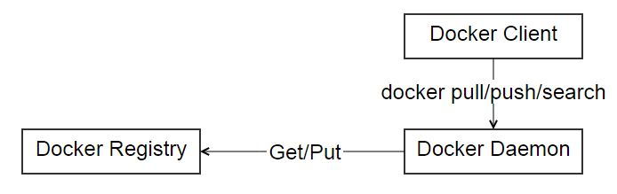

### docker简介

```python
- Docker 到底是个什么东西呢？我们在理解 Docker 之前，首先得先区分清楚两个概念，容器和虚拟机。
- 可能很多读者朋友都用过虚拟机，而对容器这个概念比较的陌生。我们用的传统虚拟机如 VMware ， VisualBox 之类的需要模拟整台机器包括硬件。

- 每台虚拟机都需要有自己的操作系统，虚拟机一旦被开启，预分配给它的资源将全部被占用。每一台虚拟机包括应用，必要的二进制和库，以及一个完整的用户操作系统。
- 而容器技术是和我们的宿主机共享硬件资源及操作系统，可以实现资源的动态分配。
- 容器包含应用和其所有的依赖包，但是与其他容器共享内核。容器在宿主机操作系统中，在用户空间以分离的进程运行。
- 容器技术是实现操作系统虚拟化的一种途径，可以让您在资源受到隔离的进程中运行应用程序及其依赖关系。
- 通过使用容器，我们可以轻松打包应用程序的代码、配置和依赖关系，将其变成容易使用的构建块，从而实现环境一致性、运营效率、开发人员生产力和版本控制等诸多目标。
- 容器可以帮助保证应用程序快速、可靠、一致地部署，其间不受部署环境的影响。
- 容器还赋予我们对资源更多的精细化控制能力，让我们的基础设施效率更高。
```
###### 通过下面这幅图，我们可以很直观的反映出这两者的区别所在：


```python
- Docker 属于 Linux 容器的一种封装，提供简单易用的容器使用接口。它是目前最流行的 Linux 容器解决方案。
- 而 Linux 容器是 Linux 发展出的另一种虚拟化技术，简单来讲， Linux 容器不是模拟一个完整的操作系统，而是对进程进行隔离，相当于是在正常进程的外面套了一个保护层。
- 对于容器里面的进程来说，它接触到的各种资源都是虚拟的，从而实现与底层系统的隔离。
- Docker 将应用程序与该程序的依赖，打包在一个文件里面。运行这个文件，就会生成一个虚拟容器。
- 程序在这个虚拟容器里运行，就好像在真实的物理机上运行一样。有了 Docker ，就不用担心环境问题。
- 总体来说，Docker 的接口相当简单，用户可以方便地创建和使用容器，把自己的应用放入容器。容器还可以进行版本管理、复制、分享、修改，就像管理普通的代码一样。
```
#### Docker 的优势
```python
  - 1.Docker 启动快速属于秒级别。虚拟机通常需要几分钟去启动。
  - 2. Docker 需要的资源更少。Docker 在操作系统级别进行虚拟化，Docker 容器和内核交互，几乎没有性能损耗，性能优于通过 Hypervisor 层与内核层的虚拟化。
  - 3. Docker 更轻量。Docker 的架构可以共用一个内核与共享应用程序库，所占内存极小。同样的硬件环境，Docker 运行的镜像数远多于虚拟机数量，对系统的利用率非常高。
  - 4. 与虚拟机相比，Docker 隔离性更弱。Docker 属于进程之间的隔离，虚拟机可实现系统级别隔离。
  - 5. 安全性。Docker 的安全性也更弱，Docker 的租户 Root 和宿主机 Root 等同，一旦容器内的用户从普通用户权限提升为 Root 权限，它就直接具备了宿主机的 Root 权限，进而可进行无限制的操作。。
  - 6. 可管理性。Docker 的集中化管理工具还不算成熟。各种虚拟化技术都有成熟的管理工具，例如 VMware vCenter 提供完备的虚拟机管理能力。
  - 7.高可用和可恢复性。Docker 对业务的高可用支持是通过快速重新部署实现的。
  - 8. 虚拟化具备负载均衡，高可用，容错，迁移和数据保护等经过生产实践检验的成熟保障机制， VMware 可承诺虚拟机 99.999% 高可用，保证业务连续性。
  - 9. 快速创建、删除。虚拟化创建是分钟级别的，Docker 容器创建是秒级别的，Docker 的快速迭代性，决定了无论是开发、测试、部署都可以节约大量时间
  - 10. 交付、部署。虚拟机可以通过镜像实现环境交付的一致性，但镜像分发无法体系化。Docker 在   - 11. Dockerfile 中记录了容器构建过程，可在集群中实现快速分发和快速部署。
```

###### 我们可以从下面这张表格很清楚地看到容器相比于传统虚拟机的特性的优势所在：


#### Docker 的三个基本概念


* 从上图我们可以看到，Docker 中包括三个基本的概念：
  * Image（镜像）
  * Container（容器）
  * Repository（仓库）

* 镜像是 Docker 运行容器的前提，仓库是存放镜像的场所，可见镜像更是 Docker 的核心。

##### Image（镜像）

那么镜像到底是什么呢？
- Docker 镜像可以看作是一个特殊的文件系统，除了提供容器运行时所需的程序、库、资源、配置等文件外，还包含了一些为运行时准备的一些配置参数（如匿名卷、环境变量、用户等）。

- 镜像不包含任何动态数据，其内容在构建之后也不会被改变。镜像（Image）就是一堆只读层（read-only layer）的统一视角，也许这个定义有些难以理解，下面的这张图能够帮助读者理解镜像的定义：


- 从左边我们看到了多个只读层，它们重叠在一起。除了最下面一层，其他层都会有一个指针指向下一层。这些层是 Docker 内部的实现细节，并且能够在主机的文件系统上访问到。

- 统一文件系统（Union File System）技术能够将不同的层整合成一个文件系统，为这些层提供了一个统一的视角。

- 这样就隐藏了多层的存在，在用户的角度看来，只存在一个文件系统。我们可以在图片的右边看到这个视角的形式。

##### Container（容器）

- 容器（Container）的定义和镜像（Image）几乎一模一样，也是一堆层的统一视角，唯一区别在于容器的最上面那一层是可读可写的。


- 由于容器的定义并没有提及是否要运行容器，所以实际上，容器 = 镜像 + 读写层。

##### Repository（仓库）

- Docker 仓库是集中存放镜像文件的场所。镜像构建完成后，可以很容易的在当前宿主上运行。

- 但是， 如果需要在其他服务器上使用这个镜像，我们就需要一个集中的存储、分发镜像的服务，Docker Registry（仓库注册服务器）就是这样的服务。

- 有时候会把仓库（Repository）和仓库注册服务器（Registry）混为一谈，并不严格区分。

- Docker 仓库的概念跟 Git 类似，注册服务器可以理解为 GitHub 这样的托管服务。

- 实际上，一个 Docker Registry 中可以包含多个仓库（Repository），每个仓库可以包含多个标签（Tag），每个标签对应着一个镜像。

- 所以说，镜像仓库是 Docker 用来集中存放镜像文件的地方，类似于我们之前常用的代码仓库。

- 通常，一个仓库会包含同一个软件不同版本的镜像，而标签就常用于对应该软件的各个版本 。

- 我们可以通过<仓库名>:<标签>的格式来指定具体是这个软件哪个版本的镜像。如果不给出标签，将以 Latest 作为默认标签。

###### 仓库又可以分为两种形式：
  - Public（公有仓库）
  - Private（私有仓库）

```python
- Docker Registry 公有仓库是开放给用户使用、允许用户管理镜像的 Registry 服务。

- 一般这类公开服务允许用户免费上传、下载公开的镜像，并可能提供收费服务供用户管理私有镜像。

- 除了使用公开服务外，用户还可以在本地搭建私有 Docker Registry。Docker 官方提供了 Docker Registry 镜像，可以直接使用做为私有 Registry 服务。

- 当用户创建了自己的镜像之后就可以使用 Push 命令将它上传到公有或者私有仓库，这样下次在另外一台机器上使用这个镜像时候，只需要从仓库上 Pull 下来就可以了。

- 我们主要把 Docker 的一些常见概念如 Image，Container，Repository 做了详细的阐述，也从传统虚拟化方式的角度阐述了 Docker 的优势。
```

###### 我们从下图可以直观地看到 Docker 的架构：


- Docker 使用 C/S 结构，即客户端/服务器体系结构。Docker 客户端与 Docker 服务器进行交互，Docker服务端负责构建、运行和分发 Docker 镜像。
- Docker 客户端和服务端可以运行在一台机器上，也可以通过 RESTful 、 Stock 或网络接口与远程 Docker 服务端进行通信。

###### 我们从下图可以直观地看到 Docker 的运行：


- 这张图展示了 Docker 客户端、服务端和 Docker 仓库（即 Docker Hub 和 Docker Cloud ），默认情况下 Docker 会在 Docker 中央仓库寻找镜像文件。
- 这种利用仓库管理镜像的设计理念类似于 Git ，当然这个仓库是可以通过修改配置来指定的，甚至我们可以创建我们自己的私有仓库。

- Docker 的核心组件包括：
    - Docker Client
    - Docker Daemon
    - Docker Image
    - Docker Registry
    - Docker Container

- Docker 采用的是 Client/Server 架构。客户端向服务器发送请求，服务器负责构建、运行和分发容器。

- 客户端和服务器可以运行在同一个 Host 上，客户端也可以通过 Socket 或 REST API 与远程的服务器通信。

- 可能很多朋友暂时不太理解一些东西，比如 REST API 是什么东西等，不过没关系，在后面的文章中会一一给大家讲解清楚。

##### Docker Client
```shell
Docker Client ，也称 Docker 客户端。它其实就是 Docker 提供命令行界面（CLI）工具，是许多 Docker 用户与 Docker 进行交互的主要方式。

客户端可以构建，运行和停止应用程序，还可以远程与 Docker_Host 进行交互。

最常用的 Docker 客户端就是 Docker 命令，我们可以通过 Docker 命令很方便地在 Host 上构建和运行 Docker 容器。
```

##### Docker Daemon
```shell
Docker Daemon 是服务器组件，以 Linux 后台服务的方式运行，是 Docker 最核心的后台进程，我们也把它称为守护进程。

它负责响应来自 Docker Client 的请求，然后将这些请求翻译成系统调用完成容器管理操作。

该进程会在后台启动一个 API Server ，负责接收由 Docker Client 发送的请求，接收到的请求将通过 Docker Daemon 内部的一个路由分发调度，由具体的函数来执行请求
```
```shell
[root@harbor ~]# systemctl status docker
● docker.service - Docker Application Container Engine
   Loaded: loaded (/usr/lib/systemd/system/docker.service; disabled; vendor preset: disabled)
   Active: active (running) since 四 2019-05-09 11:47:57 CST; 39s ago
     Docs: https://docs.docker.com
 Main PID: 77532 (dockerd)
    Tasks: 19
   Memory: 14.7M
   CGroup: /system.slice/docker.service
           ├─77532 /usr/bin/dockerd
           └─77546 docker-containerd -l unix:///var/run/docker/libcontainerd/docker-containerd.sock --metrics-interval=0 --start-timeout 2m --state-dir /var/run/docker/libcontainerd/contai...

5月 09 11:47:49 harbor dockerd[77532]: time="2019-05-09T11:47:49.274274126+08:00" level=info msg="libcontainerd: new containerd process, pid: 77546"
5月 09 11:47:52 harbor dockerd[77532]: time="2019-05-09T11:47:52.014337983+08:00" level=info msg="Graph migration to content-addressability took 0.00 seconds"
5月 09 11:47:52 harbor dockerd[77532]: time="2019-05-09T11:47:52.082381501+08:00" level=info msg="Loading containers: start."
5月 09 11:47:53 harbor dockerd[77532]: time="2019-05-09T11:47:53.552185866+08:00" level=info msg="Firewalld running: false"
5月 09 11:47:54 harbor dockerd[77532]: time="2019-05-09T11:47:54.996355756+08:00" level=info msg="Default bridge (docker0) is assigned with an IP address 172.17.0.0/16. Daemo...d IP address"
5月 09 11:47:55 harbor dockerd[77532]: time="2019-05-09T11:47:55.647275711+08:00" level=info msg="Loading containers: done."
5月 09 11:47:56 harbor dockerd[77532]: time="2019-05-09T11:47:56.952869552+08:00" level=info msg="Daemon has completed initialization"
5月 09 11:47:56 harbor dockerd[77532]: time="2019-05-09T11:47:56.953318627+08:00" level=info msg="Docker daemon" commit=f5ec1e2 graphdriver=overlay version=17.03.2-ce
5月 09 11:47:57 harbor systemd[1]: Started Docker Application Container Engine.
5月 09 11:47:57 harbor dockerd[77532]: time="2019-05-09T11:47:57.018425154+08:00" level=info msg="API listen on /var/run/docker.sock"
Hint: Some lines were ellipsized, use -l to show in full.
```

##### Docker Image
```shell
Docker 镜像可以看作是一个特殊的文件系统，除了提供容器运行时所需的程序、库、资源、配置等文件外
还包含了一些为运行时准备的一些配置参数（如匿名卷、环境变量、用户等）。

镜像不包含任何动态数据，其内容在构建之后也不会被改变。我们可将 Docker 镜像看成只读模板，通过它可以创建 Docker 容器。

- 镜像有多种生成方法：
     * 从无到有开始创建镜像
     * 下载并使用别人创建好的现成的镜像
     * 在现有镜像上创建新的镜像

我们可以将镜像的内容和创建步骤描述在一个文本文件中，这个文件被称作 Dockerfile
通过执行 docker build <docker-file>命令可以构建出 Docker 镜像。
```
##### Docker Registry

Docker Registry 是存储 Docker Image 的仓库，它在 Docker 生态环境中的位置如下图所示：



运行 docker push、docker pull、docker search 时，实际上是通过 Docker Daemon 与 Docker Registry 通信。

##### Docker Container
```shell
Docker 容器就是 Docker 镜像的运行实例，是真正运行项目程序、消耗系统资源、提供服务的地方。

Docker Container 提供了系统硬件环境，我们可以使用 Docker Images 这些制作好的系统盘，再加上我们所编写好的项目代码，Run 一下就可以提供服务啦。
```
##### Docker 组件是如何协作运行容器
```shell
看到这里，我相信各位读者朋友们应该已经对 Docker 基础架构熟悉的差不多了，我们还记得运行的第一个容器吗？

现在我们再通过 hello-world 这个例子来体会一下 Docker 各个组件是如何协作的。

容器启动过程如下：
    Docker 客户端执行 docker run 命令。
    Docker Daemon 发现本地没有 hello-world 镜像。
    Daemon 从 Docker Hub 下载镜像。
    下载完成，镜像 hello-world 被保存到本地。
    Docker Daemon 启动容器。

```
