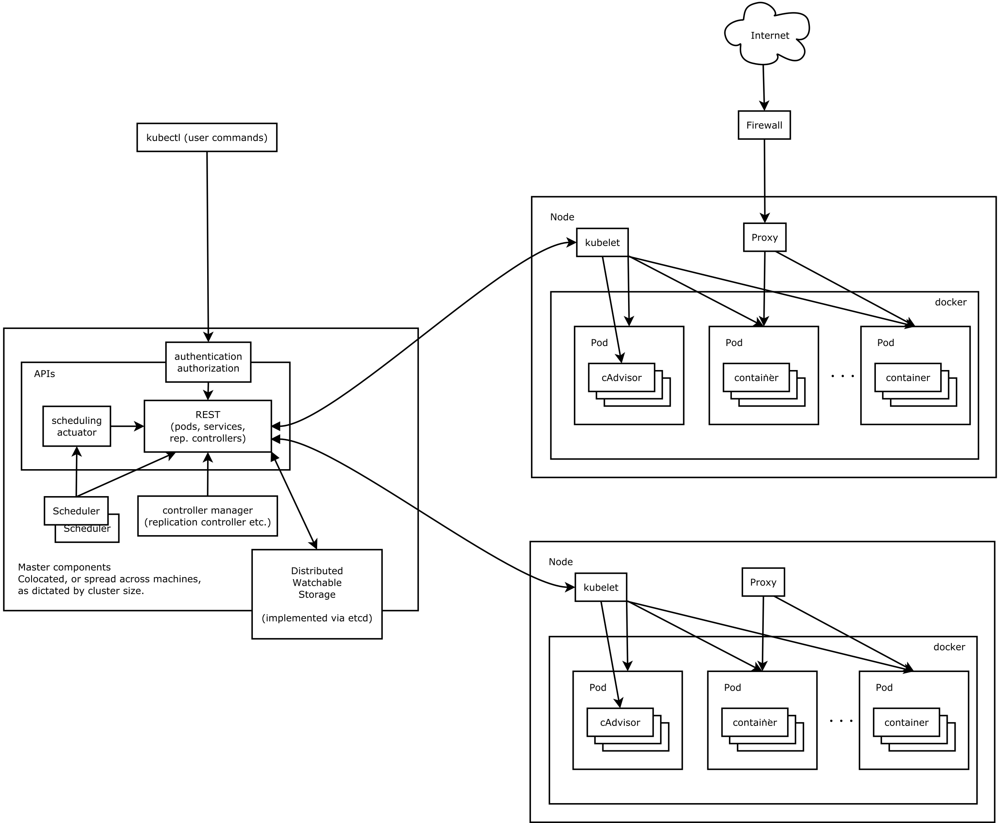

#### Kubernets简介

- 1.背景介绍
  - 云计算飞速发展
    - IaaS
    - PaaS
    - SaaS
  - Docker技术突飞猛进
    - 一次构建，到处运行
    - 容器的快速轻量
    - 完整的生态环境

- 2.什么是kubernetes
  ```shell
  基于容器技术的分布式架构领先方案。
  Kubernetes(k8s)是Google开源的容器集群管理系统（谷歌内部:Borg）。
  在Docker技术的基础上，为容器化的应用提供部署运行、资源调度、服务发现和动态伸缩等一系列完整功能，提高了大规模容器集群管理的便捷性。
  ```
  ```shell
  完备的分布式系统支撑平台，
  具有完备的集群管理能力，
  多扩多层次的安全防护和准入机制、
  多租户应用支撑能力、
  透明的服务注册和发现机制、
  內建智能负载均衡器、
  强大的故障发现和自我修复能力、
  服务滚动升级和在线扩容能力、
  可扩展的资源自动调度机制以及多粒度的资源配额管理能力。
  同时Kubernetes提供完善的管理工具，涵盖了包括开发、部署测试、运维监控在内的各个环节。
  ```
- 3.Kubernetes优势:
  ```shell
  - 容器编排
  - 轻量级
  - 开源
  - 弹性伸缩
  - 负载均衡
  ```


- ##### Kubernetes架构图(看不懂没有关系，后面详解)


