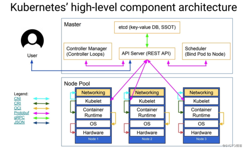

### Kubernetes组件

###### 架构图

- Kubernetes将集群中的机器划分为一个Master节点和一群工作节点Node，

- Master节点运行着集群管理相关的一组进程kube-apiserver、kube-controller-manager和kube-scheduler，这些进程实现了整个集群的资源管理、Pod调度、弹性伸缩、安全控制、系统监控和纠错等管理能力，并且都是全自动完成的。

- Node作为集群中的工作节点，运行真正的应用程序，在Node上Kubernetes管理的最小运行单元是Pod。Node上运行着Kubernetes的kubelet、kube-proxy服务进程，这些服务进程负责Pod的创建、启动、监控、重启、销毁以及实现软件模式的负载均衡器。

---
- 1.Master

  > k8s集群的管理节点，负责管理集群，提供集群的资源数据访问入口。拥有Etcd存储服务（可选），运行Api Server进程，Controller Manager服务进程及Scheduler服务进程，关联工作节点Node。Kubernetes API server提供HTTP Rest接口的关键服务进程，是Kubernetes里所有资源的增、删、改、查等操作的唯一入口。也是集群控制的入口进程；Kubernetes Controller Manager是Kubernetes所有资源对象的自动化控制中心；Kubernetes Schedule是负责资源调度（Pod调度）的进程,每个Master节点都运行着以下一组关键进程

  - apiserver提供了资源操作的唯一入口，并提供认证、授权、访问控制、API注册和发现等机制；
  - controller manager负责维护集群的状态，比如故障检测、自动扩展、滚动更新等；
  - scheduler负责资源的调度，按照预定的调度策略将Pod调度到相应的机器上

- 2.Node

  > Node是Kubernetes集群架构中运行Pod的服务节点（亦叫agent或minion）。Node是Kubernetes集群操作的单元，用来承载被分配Pod的运行，是Pod运行的宿主机。关联Master管理节点，拥有名称和IP、系统资源信息。运行docker eninge服务，守护进程kunelet及负载均衡器kube-proxy.每个Node节点都运行着以下一组关键进程

  - kubelet负责维护容器的生命周期，同时也负责Volume（CSI）和网络（CNI）的管理；
  - Container runtime负责镜像管理以及Pod和容器的真正运行（CRI）；
  - kube-proxy负责为Service提供cluster内部的服务发现和负载均衡；

  > Node节点可以在运行期间动态增加到Kubernetes集群中，默认情况下，kubelet会向master注册自己，这也是Kubernetes推荐的Node管理方式，kubelet进程会定时向Master汇报自身情报，如操作系统、Docker版本、CPU和内存，以及有哪些Pod在运行等等，这样Master可以获知每个Node节点的资源使用情况，冰实现高效均衡的资源调度策略。
